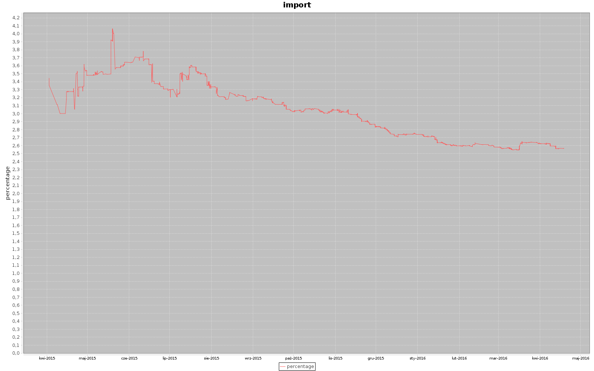
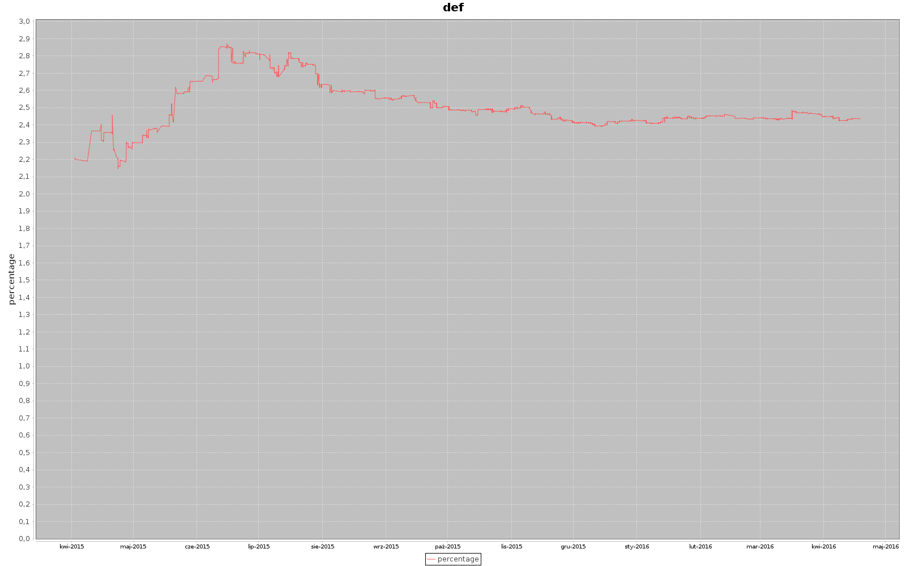
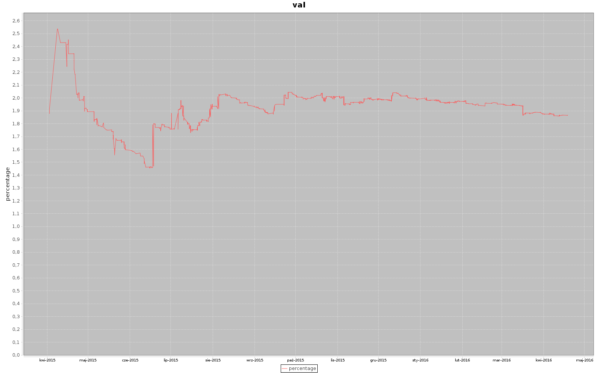

# trendy-src
Wordcounts from source files throughout git history

Initial code by [profes](https://github.com/profes) as an exercise solution for [scalania](http://www.meetup.com/WarsawScala/) meeting.

# Usage

First, you need a clean Postgresql database.  Copy src/main/resources/application.conf.template to application.conf in the same directory, and fill it with connection/login information (ip address, database name, user and password).

Run create table wordcounts statement from src/main/resources/sql/create_table.sql script on the database.

Start sbt console in root project directory

    sbt console
  
Prepare absolute path to directory containing git repository of scala application (with many "*.scala" files), and use it to load history of wordcounts into the database:

    scala> LoadApi.loadAll("/home/bka/kod/github/caves", 50)
    
Next, run whole script src/main/resources/sql/prepare_for_analysis.sql on the database.

Make directory for charts
    
    mkdir caves_charts
    
Start sbt console again

    sbt console
    
Generate charts for 100 top words

    ReportApi.charts("./caves_charts")
    
Enjoy viewing the charts!

